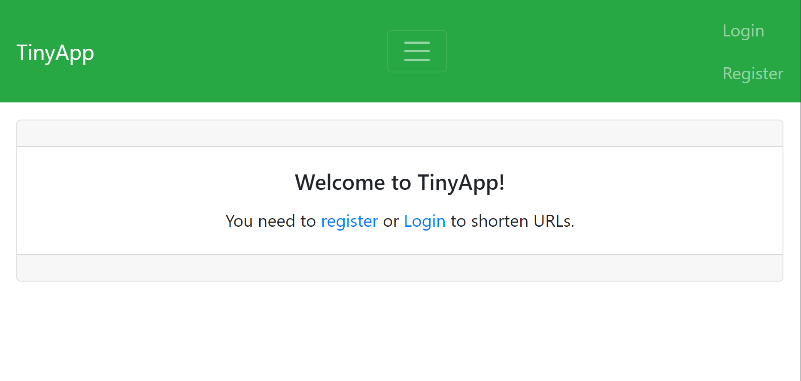

# TinyApp Project

TinyApp is a full stack web application built with Node and Express that allows users to shorten long URLs (à la bit.ly).

## Final Product




## Dependencies

- Node.js
- Express
- EJS
- bcryptjs
- cookie-session

## Getting Started

- Install all dependencies (using the `npm install` command).
- Run the development web server using the `node express_server.js` command.
- Go to [localhost:8080](http://localhost:8080)  in your browser.
```
 To start the project, run the following command:
 
  npm start

 To test the project, run the following command: 

  npm test
```

# How to use TinyApp
 
## Register/Login:
 Users must be logged in to creat new links, view them, and edit them.
click Register button , put on it email and password to register.

## Creat New Links
Either click Creat a New Short Link in My URLs page,or Creat New URL you want to shorten.
##Edit or Delete Short Links 
. In My URLs,you can delet any link you want.
. You can also click Edit, and then enter a new   long URL to update your link.It will be the same short URL, but redirect to an updated long URL.

## User Short Link
.The path to use any short link is /u/:shortLink.This will redirect you the long URL.
.You can reach this by clicking edit on the a link corresponding to short URL.


